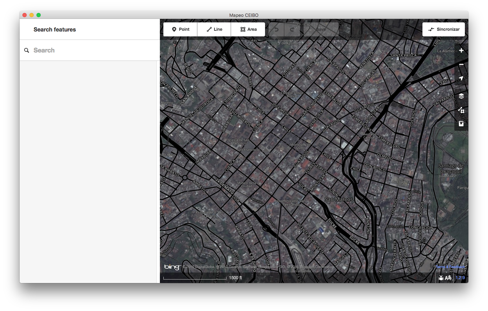
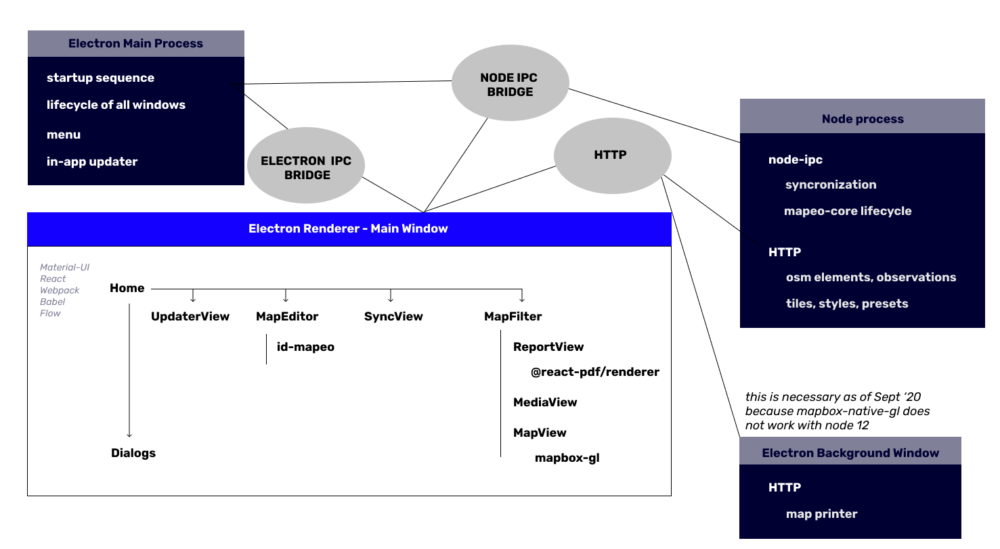

# Mapeo Desktop

[](https://github.com/digidem/mapeo-desktop/actions)

An offline map editing application for indigenous territory mapping in remote
environments. It uses [mapeo-core](https://github.com/digidem/mapeo-core) for
offline peer-to-peer synchronization of an OpenStreetMap database, without any
server. The map editor is based on [iDEditor](https://github.com/openstreetmap/iD/),
a simple and easy to use editor for OpenStreetMap. The app is built with
[Electron](http://electronjs.org).

This project is considered stable and used by over 150 communities.



For a mobile application that is compatible with Mapeo Desktop, see [Mapeo Mobile](https://github.com/digidem/mapeo-mobile).

## Guide

Read the [online user guide](https://digital-democracy.gitbook.io/mapeo/) for
information on how to install aerial imagery and tiles, custom configurations,
and more.



## Getting Started

To clone and install all dependencies and start a process to re-build the app whenever you change a file:

```sh
git clone git@github.com:digidem/mapeo-desktop.git
cd mapeo-desktop
npm install
npm run build:translations
npm run watch
```

Before proceeding, you will have to wait until some background processes have culminated. You will know this has taken place when you see terminal output indicating that your app (and assets such as translations) have been built.

Then, in another terminal, run the app in development mode:

```sh
npm run dev
```

Running `npm run dev` will run the background process in an electron window
that can be stepped through similarly to the front-end code.

To see log messages in real-time while in debug mode, run `tail` in another
terminal window:

```sh
tail -f USERDATA/Mapeo/logs/$DATE.debug.log
```

## Contributing

See [docs/CONTRIBUTING.md](docs/CONTRIBUTING.md) for more details.

## Community

Connect with the Mapeo community for support & to contribute!

- [**Discord**](https://discord.gg/KWRFDh3v73)

## License

GPLv3
