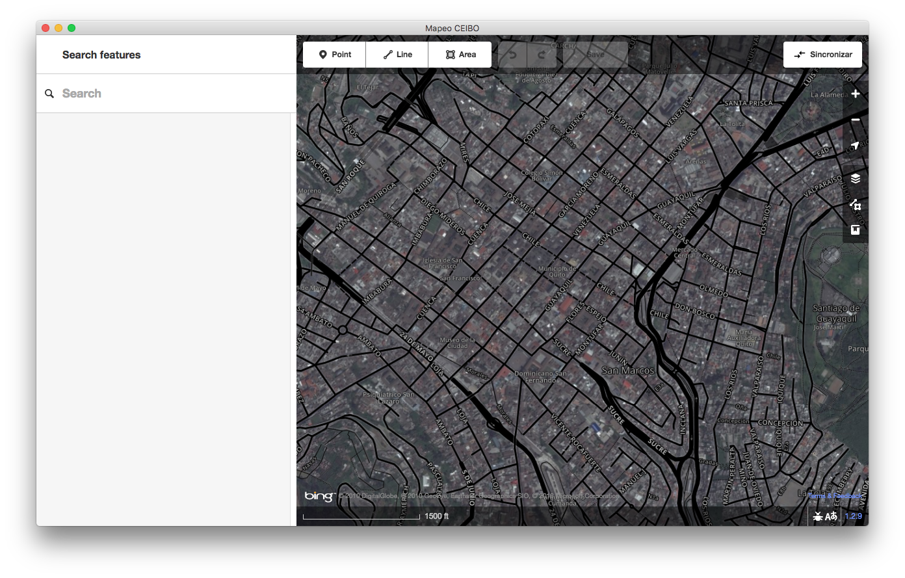

# Mapeo Desktop

An _experimental_ offline mapping app for indigenous territory mapping in remote
environments. It uses [osm-p2p](https://github.com/digidem/osm-p2p-db) for
offline peer-to-peer synchronization of an OpenStreetMap database, without any
server. The editor is based on [iDEditor](https://github.com/openstreetmap/iD/),
a simple and easy to use editor for OpenStreetMap. The app is web app built with
[Electron](http://electron.atom.io) for desktop integration and offline usage.

This project is under active development and is still at the prototype phase,
although we are already testing it out in the field in Ecuador.



# Getting Started

To clone and install all dependencies and start the program, execute

```
$ git clone git@github.com:digidem/mapeo-desktop.git
$ cd mapeo-desktop
$ npm install
$ npm run build
$ npm run rebuild-leveldb
$ npm start
```

# Local Development

To run the application with debugging enabled, execute

```
$ npm run dev
```

# Packaging

Mapeo uses [Electron](http://electron.atom.io/). To package the Electron app as
a native Windows `.exe` or macOS `.dmg`, execute

```
$ npm run installer-win
```
or
```
$ npm run dmg-mac
```

The resultant installer or DMG will be placed in the `./dist` folder.

# Creating a Release

Mapeo uses [GitHub Releases](https://help.github.com/articles/about-releases/)
for deployment.

To create a release, simply push a git tag to the repository. A convenient way
to both advance the project by a version *and* push a tag is using the `npm
version` command. To create a new minor version and push it to the github
repository to initiate a build, one might run

```
$ npm version minor

$ git push --tags
```

A github release will be created automatically. Simultaneously, an
[Appveyor](appveyor.yml) build will be started to create a Windows installer,
and a [Travis](.travis.yml) build will be started for a macOS DMG. Each will be
added to the github release asynchronously as they complete.

You'll be able to find the results on the project's [releases](../../releases/) page.

# Custom Imagery

To add local tiles for offline use, copy or symlink a folder of tiles into
'tiles' within the app's folder in your application directory, which by default
points to:

- `%APPDATA%` on Windows
- `$XDG_CONFIG_HOME` or `~/.config` on Linux
- `~/Library/Application Support` on macOS

The app folder will be `electron` if you are in development, or the application
name (currently "Mapeo") if you are working with the packaged app. E.g. on a
mac, copy the folder of image tiles into: `~/Library/Application
Support/Mapeo/tiles`

Edit `imagery.json` accordingly with a type of `tms`. The tileserver runs on
localhost on port `5005`. For example:

``` json
[
  {
    "name": "local guyana tiles",
    "type": "tms",
    "template": "http://localhost:5005/guyana/{zoom}/{x}/{y}.jpg",
    "polygon": [
      [[2.115, -59.28],[2.345,-59.05]]
    ]
  }
]
```

```
$ ln -s ~/data/guyana_tiles/LC82310582015254LGN00 public/tiles/guyana
```

# Custom Presets

(coming soon)

# License

MIT
