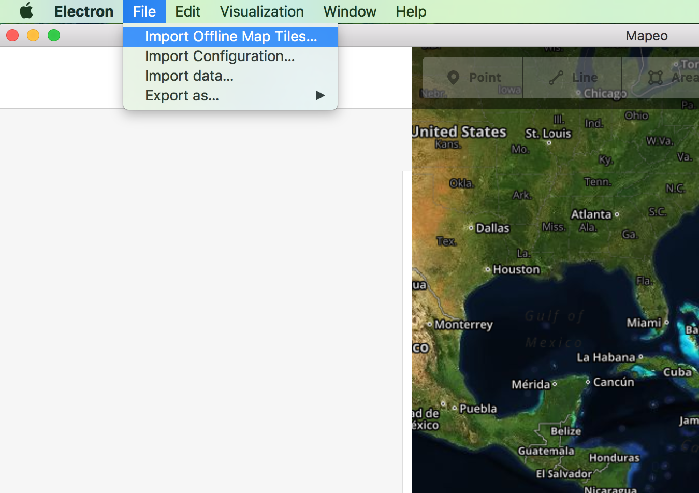

# Using offline aerial imagery with Mapeo

These instructions were written with
[POSIX](https://en.wikipedia.org/wiki/POSIX) systems in mind (Linux, macOS).
Windows users may have to infer some of the differences in the commands shown.


### Automatic Import

Mapeo has a built-in tile importer. Go to File->Import Offline Map Tiles... and
point Mapeo to the tiles you want to use. It accepts a `.tar` file or a
directory.



### Download the Tile Data

Need tile data? First, make sure you have [npm](https://www.npmjs.com/get-npm) installed.

Next, install [tile-dl](https://github.com/noffle/tile-dl):

```
npm install --global tile-dl
```

`tile-dl` needs to be told the latitude, longitude, zoom level, and radius of
the area to download locally.

To find the latitude and longitude of the area, open Mapeo Desktop and navigate
to the rough centre of the area you're interested in. In the bottom right hand
corner of the screen you'll see two numbers separated by a comma. These are your
current longitude and latitude (in that order). Note them.

Let's store the template for a map tile provider for use by tile-dl:
```
$ echo 'https://c.tiles.mapbox.com/v4/digitalglobe.0a8e44ba/{z}/{x}/{y}.png?access_token=pk.eyJ1IjoiZGlnaXRhbGdsb2JlIiwiYSI6ImNqOGRmNW9qZjBudmgzMnA1a294OGRtNm8ifQ.06mo-nDisy4KmqjYxEVwQw' > url_template
```
On Windows
``` cmd
Set url_template="https://c.tiles.mapbox.com/v4/digitalglobe.0a8e44ba/{z}/{x}/{y}.png?access_token=pk.eyJ1IjoiZGlnaXRhbGdsb2JlIiwiYSI6ImNqOGRmNW9qZjBudmgzMnA1a294OGRtNm8ifQ.06mo-nDisy4KmqjYxEVwQw"
```

Now you can invoke the `tile-dl` program:

```
$ tile-dl -t "$(cat url_template)" --lon=-122.2632601 --lat=37.8027446 \
          --radius 0.1 --zoom 12 --output tiles/{z}/{x}/{y}.png
```
On Windows
``` cmd
tile-dl -t %url_template% --lon=-122.2632601 --lat=37.8027446 --radius 0.1 --zoom 12 --output tiles/{z}/{x}/{y}.png
```

This example downloads the area around Oakland, California. You can tweak the
parameters to meet your needs:

- `lat`: The latitude at the centre of your download area.
- `lon`: The longitude at the centre of your download area.
- `radius`: The size of the area to download, in kilometres.
- `zoom`: The zoom level to use. 9 is a very wide area; 11 is a large area; 13
  is the size of a village; 16 is the size of a small road.

The above zoom level figures are very rough. Experiment with small radii and see
how the results look: you can open the resulting JPGs or PNGs with an image
viewer and see if they look appropriate to your needs.

Map tile providers offer these satellite images for free; please don't abuse
their generosity by downloading more than what you need.

## Tell Mapeo about the imagery

If you'd like more fine-grained control of your imagery, and do not want to use our autmoatic import tool, you can manage it yourself on the filesystem.

Copy the folder of tiles into a folder named `tiles` in Mapeo's folder in your
application directory. Note that on Windows Settings & Data (Subfolder `Roaming`) is seperated from the application (Subfolder `local`).
By default this is

- `%APPDATA%\Roaming` on Windows
- `$XDG_CONFIG_HOME` or `~/.config` on Linux
- `~/Library/Application Support` on macOS

The app folder will be `Electron` if you are in development, or `Mapeo` if you
are working with the packaged app.

So, e.g. on macOS, copy the folder of image tiles into: `~/Library/Application
Support/Mapeo/tiles/guyana`. The name of the sub-folder after `tiles/` doesn't
matter, but this helps keep your offline data separate.

Now edit or create `imagery.json` in the same directory. It will contain a JSON
array of imagery sources. Add a new entry to that array like

``` json
{
  "name": "local guyana tiles",
  "type": "tms",
  "template": "http://localhost:5005/guyana/{zoom}/{x}/{y}.jpg",
  "scaleExtent": [ 0, 22 ],
  "overzoom": true,
  "default": false,
  "overlay": true
}
```

In the example above, replace `guyana` with the name of the folder you chose
inside of `tiles/`.

## Launch Mapeo Desktop

Press 'b' to open the imagery layers menu. Choose the name of the imagery you
added from the bottom list.

Navigate to where you downloaded the imagery for, and use 'b' again to open the
menu; disable the default imagery (probably Bing) from the top list. You should
see your offline imagery now. If so: you're ready! The imagery you're seeing is
being loaded from your machine's local hard drive!
